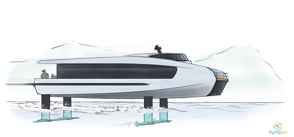
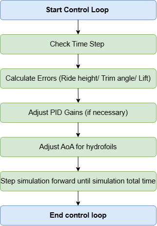
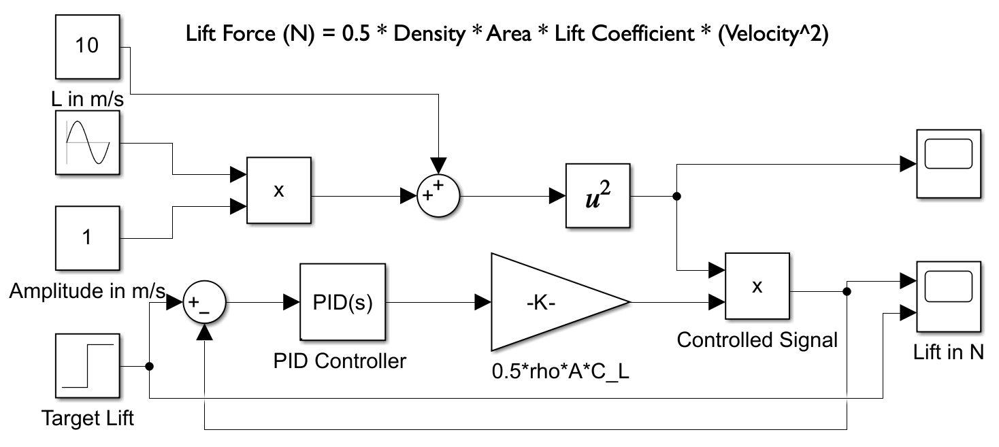

## Motivation

Hydrofoils play a crucial role in enhancing the efficiency of marine transport by reducing hydrodynamic drag, but maintaining stability under varying operational conditions remains a significant challenge. Fully submerged hydrofoils provide greater stability in rough seas but are not inherently self-stabilizing, requiring active control mechanisms. This research focuses on developing a control system using a Proportional-Integral-Derivative (PID) controller to regulate the hydrofoil's angle of attack (AoA), ensuring stable ride height and trim.

## Methodology

The project utilized a coupled Computational Fluid Dynamics (CFD) and PID control framework to evaluate hydrodynamic behavior under steady, unsteady, and multiphase flow conditions. 

*   **CFD & Multiphase Modeling:** Simulations were executed in STAR-CCM+ using the Volume of Fluid (VOF) method to capture the water-air interface and simulate wave effects. A semi-2D setup was employed to maintain computational efficiency while approximating 3D multiphase behavior.
*   **Dynamic Fluid-Body Interaction (DFBI):** The DFBI model was integrated to allow dynamic responses to hydrodynamic forces, specifically motion in heave (vertical ride height) and trim (pitch angle). 
*   **Control System Integration:** The PID controller was embedded directly into STAR-CCM+ using a custom Java Macro script. This allowed the CFD solver and the control algorithm to interact seamlessly, adjusting the AoA dynamically based on real-time lift force feedback.
*   **Simulink Approximation:** MATLAB/Simulink was used in parallel to model system dynamics, simulate noise, and approximate optimal PID gains prior to full CFD integration.

The standard PID control law applied to calculate the AoA correction is defined as:

$$
u(t) = K_p e(t) + K_i \int_0^t e(\tau)d\tau + K_d \frac{de(t)}{dt}
$$

<figure className="flex flex-col items-center my-8">
  
  <figcaption className="text-center mt-3 text-sm text-gray-400">
    Figure: Control Loop
  </figcaption>
</figure>

<figure className="flex flex-col items-center my-8">
  
  <figcaption className="text-center mt-3 text-sm text-gray-400">
    Figure: Simulink Modelling for Hydrofoil Control System in Unsteady Flow Conditions
  </figcaption>
</figure>

## Results & Analysis

The integrated CFD-PID control framework effectively mitigated lift fluctuations and improved overall vessel stability, though several dynamic challenges were identified.

*   **Signal Filtering & Noise Reduction:** Wave-induced disturbances introduced severe high-frequency noise into the lift signal, causing abrupt and destabilizing AoA adjustments. An Exponential Moving Average (EMA) filter was implemented and optimized at a smoothing factor of $\alpha=0.5$ to balance system responsiveness with noise suppression.
*   **Discrete Control Updates:** A discrete PID controller (updating at fixed 0.1-second intervals) was utilized instead of a continuous one. This prevented rapid, instantaneous AoA changes that caused massive "lift spikes" and numerical instability in the coupled simulation.
*   **Submergence Depth Impacts:** At shallow depths (e.g., 0.1 m), wave-induced disturbances were highly pronounced, requiring aggressive AoA limits but resulting in oscillatory behavior. At deeper submergences (e.g., 0.6 m), free-surface interference was minimized, leading to smoother lift generation, though hydrodynamic drag increased.
*   **Ride Height Regulation:** The controller successfully maintained target ride heights and trim angles, though aggressive adjustments often drove the front hydrofoil to its maximum mechanical limits ($10^\circ$ and $-8^\circ$). 

Ultimately, while the PID framework proved capable in steady environments, the non-linearities of multiphase wave interactions suggest that future iterations could benefit from advanced strategies like Model Predictive Control (MPC).

<a 
  href="https://drive.google.com/file/d/1ecGG4JtQLiRoKZZudadM6DGxUjM5yRTE/view?usp=sharing" 
  target="_blank" 
  className="inline-block px-6 py-3 mt-8 text-cyan-400 border border-cyan-400 rounded hover:bg-cyan-400 hover:text-gray-900 transition-colors"
>
  🔒 Request Access to Full Master's Thesis (PDF)
</a>

  <figure>
    <video autoPlay loop muted playsInline className="w-full rounded-lg border border-gray-700 shadow-lg">
      <source src="/videos/hydrofoil-pid-control/steady-flow.mp4" type="video/mp4" />
    </video>
    <figcaption className="text-center mt-3 text-sm text-gray-400">
      PID adjustments in steady-flow conditions.
    </figcaption>
  </figure>

  <figure>
    <video autoPlay loop muted playsInline className="w-full rounded-lg border border-gray-700 shadow-lg">
      <source src="/videos/hydrofoil-pid-control/unsteady-waves.mp4" type="video/mp4" />
    </video>
    <figcaption className="text-center mt-3 text-sm text-gray-400">
      Wave-induced disturbances and AoA compensation.
    </figcaption>
  </figure>

